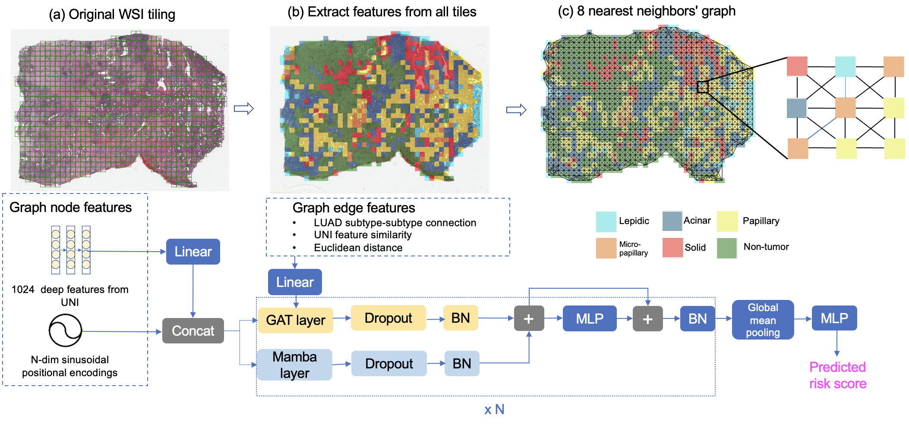

# gat-mamba
Combining Graph Neural Network and Mamba to Capture Local and Global Tissue Spatial Relationships in Whole Slide Images

In computational pathology, extracting spatial features from gigapixel whole slide images (WSIs) is a fundamental task, but due to their large size, WSIs are typically segmented into smaller tiles. A critical aspect of this analysis is aggregating information from these tiles to make predictions at the WSI level. We introduce a model that combines a message-passing graph neural network (GNN) with a state space model (Mamba) to capture both local and global spatial relationships among the tiles in WSIs. The model's effectiveness was demonstrated in predicting progression-free survival among patients with early-stage lung adenocarcinomas (LUAD). We compared the model with other state-of-the-art methods for tile-level information aggregation in WSIs, including tile-level information summary statistics-based aggregation, multiple instance learning (MIL)-based aggregation, GNN-based aggregation, and GNN-transformer-based aggregation. Additional experiments showed the impact of different types of node features and different tile sampling strategies on the model performance. This work can be easily extended to any WSI-based analysis.


## Instructions 
### Required packages
First, create a pytorch docker container using:
```
docker run  --shm-size=2g --gpus all -it --rm -v /:/workspace -v /etc/localtime:/etc/localtime:ro nvcr.io/nvidia/pytorch:24.02-py3
```
Then install all packages listed [here](./requirements/pip_commands.txt).

### Preprocessing
Download NLST data from [NLST](https://wiki.cancerimagingarchive.net/display/NLST/NLST+Pathology), download TCGA data from [TCGA-LUAD](https://portal.gdc.cancer.gov/projects/TCGA-LUAD).

Use [generate_tiles.py](./preprocessing/generate_tiles.py) to generate tiles by specifying the cohort name('nlst' or 'tcga'), the location of the input WSIs, and output tiles:
```
python generate_tiles.py --cohort_name <cohort_name> --path_to_wsi_images <path_to_wsi_images> --path_to_generated_tiles <path_to_generated_tiles>
```
Input data structure:
```
  ├── <patient_id>                   
  │   ├── <slide_id1.svs>  
  │   ├── <slide_id2.svs>   
  │   ├── <...>    
```
Output data structure:
```
  ├── <patient_id>                   
  │   ├── <tiles_png>
      │   ├──<tile_id1.png>
      │   ├──<tile_id2.png>
      │   ├──<...>

```
### Feature extraction
First, request access to the pretrained UNI model weights [here](https://huggingface.co/mahmoodlab/UNI). 

Then run [main_uni_and_luad_subtype.py](./feature_extraction/main_uni_and_luad_subtype.py) to extract all tile/node features using the tiled whole slide images from the previous step as input. 
```
CUDA_VISIBLE_DEVICES=0 python main_uni_and_luad_subtype.py --path_to_generated_tiles <path_to_generated_tiles> --path_to_extracted_features <path_to_extracted_features> --path_to_patient_outcome <path_to_patient_outcome> 
```
There will be a prompt asking for your HuggingFace access token. You can go to `Settings` and then `Access Tokens` and copy the token by `conch_uni` once you got access to the UNI weights.

Output data structure:
```
  ├── <patient_id1.csv>                   
  ├── <patient_id2.csv> 
  ├── <...> 
```
where in each csv file, the first column is slide id, second column tile name, third column patient's time to event (or follow-up time), forth column patient's event status, fifth column the LUAD histologic subtype, and the rest of the 1024 columns are the UNI features.

### Graph data construction
Run [create_dataset_uni.py](./modeling/create_dataset_uni.py) to get the procesed graph dataset object named `graph_data.pt` that can be fed into the graph modeling code in the next step, using the extracted features from the previous step as input. 
```
python create_dataset_uni.py --path_to_extracted_features <path_to_extracted_features> --processed_graph_data_path <processed_graph_data_path>
```

Output data structure:
```
  ├── <processed>                   
  │   ├── <graph_data.pt>
  │   ├── <pre_filter.pt> 
  │   ├── <pre_transform.pt> 

```
### Modeling
Run [main_gat_mamba.py](./modeling/main_gat_mamba.py). This script allows one to do both training and inference on the data and print out the train, validation, and test set C-index and test set dynamic AUC. 
```
CUDA_VISIBLE_DEVICES=0 python main_gat_mamba.py --graph_data_path <processed_graph_data_path> --cv_split_path <cv_split_path>
```

Note that `processed_graph_data_path` is the parent folder of the `processed` folder generated from the previous step.

Splits are in the following structure:
```
  ├── <splits>                   
  │   ├── <fold0>
      │   ├──pids_train.csv
      │   ├──pids_val.csv
      │   ├──pids_test.csv
  │   ├── <fold1> 
      │   ├──pids_train.csv
      │   ├──pids_val.csv
      │   ├──pids_test.csv
  │   ├── <fold2> 
      │   ├──pids_train.csv
      │   ├──pids_val.csv
      │   ├──pids_test.csv
  ...

```
Each `csv` file contains at least one column named `pid`, the patient IDs.