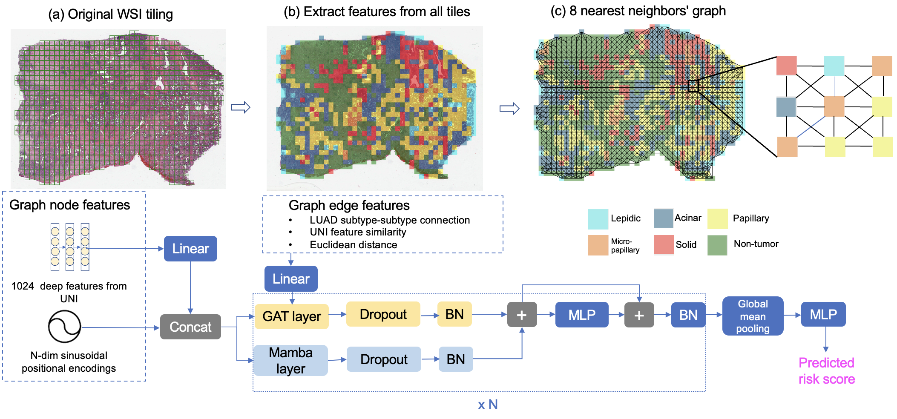

# Combining Graph Neural Network and Mamba to Capture Local and Global Tissue Spatial Relationships in Whole Slide Images

### Published journal paper
[Link](https://www.nature.com/articles/s41598-025-99042-4)

In computational pathology, extracting and representing spatial features from gigapixel whole slide images (WSIs) are fundamental tasks, but due to their large size, WSIs are typically segmented into smaller tiles. A critical aspect of analyzing WSIs is how information across tiles is aggregated to predict outcomes such as patient prognosis. We introduce a model that combines a message-passing graph neural network (GNN) with a state space model (Mamba) to capture both local and global spatial relationships among the tiles in WSIs. The model’s effectiveness was demonstrated in predicting progression-free survival among patients with early-stage lung adenocarcinomas (LUAD). We compared the model with other state-of-the-art methods for tile-level information aggregation in WSIs, including statistics-based, multiple instance learning (MIL)-based, GNN-based, and GNN-transformer-based aggregation. Our model achieved the highest c-index (0.70) and has the largest number of parameters among comparison models yet maintained a short inference time. Additional experiments showed the impact of different types of node features and different tile sampling strategies on model performance. Code: https://github.com/rina-ding/gat-mamba.



## Instructions 
### Required packages
First, create a pytorch docker container using:
```
docker run  --shm-size=2g --gpus all -it --rm -v /:/workspace -v /etc/localtime:/etc/localtime:ro pytorch/pytorch:2.2.0-cuda11.8-cudnn8-devel
```
Then install all packages listed [here](./requirements/pip_commands.sh) by running the following commands:

```
chmod +x pip_commands.sh
```
```
./pip_commands.sh
```
### Preprocessing

If you would like to use the cohorts (NLST or TCGA), magnification level, and tile size used in our paper (either size 512 by 512 at 10x (1 mpp) or 1024 by 1024 at 20x (0.5 mpp) so that the total area covered by a tile is consistent across all patients which have different magnification levels available):

1. Download NLST data from [NLST](https://wiki.cancerimagingarchive.net/display/NLST/NLST+Pathology), download TCGA data from [TCGA-LUAD](https://portal.gdc.cancer.gov/projects/TCGA-LUAD).

2. Use [generate_tiles.py](./preprocessing/generate_tiles.py) to generate tiles by specifying the location of the input WSIs, and output tiles:
```
python generate_tiles.py --path_to_wsi_images <path_to_wsi_images> --path_to_generated_tiles <path_to_generated_tiles>
```

If you would like to use other cohorts, you will run [generate_tiles_generic.py](./preprocessing/generate_tiles_generic.py) by specifying the WSI level and tile size, as well as the location of the input WSIs, and output tiles:
```
python generate_tiles_generic.py --wsi_level <wsi_level> --tile_size <tile_size> --path_to_wsi_images <path_to_wsi_images> --path_to_generated_tiles <path_to_generated_tiles>
```

Input data structure:
```
  ├── <patient_id>                   
  │   ├── <slide_id1.svs>  
  │   ├── <slide_id2.svs>   
  │   ├── <...>    
```
Output data structure:
```
  ├── <patient_id>                   
  │   ├── <tiles_png>
      │   ├──<tile_id1.png>
      │   ├──<tile_id2.png>
      │   ├──<...>

```
### Feature extraction
First, request access to the pretrained UNI model weights [here](https://huggingface.co/mahmoodlab/UNI). 

Then run [main_uni_and_luad_subtype.py](./feature_extraction/main_uni_and_luad_subtype.py) to extract all tile/node features. 
```
CUDA_VISIBLE_DEVICES=0 python main_uni_and_luad_subtype.py --path_to_generated_tiles <path_to_generated_tiles> --path_to_extracted_features <path_to_extracted_features> --path_to_patient_outcome <path_to_patient_outcome> 
```
`path_to_generated_tiles` is the parent path to the tiles generated from the previous module.

`path_to_extracted_features` is the parent path where the extracted features will be stored after running the script.

`path_to_patient_outcome` is the path to the csv file that contains three columns including patient IDs (`pid`), event status (`event`), and time to event or follow-up time in days (`days`).

There will be a prompt asking for your HuggingFace access token. You can go to `Settings` and then `Access Tokens` and copy the token by `conch_uni` once you got access to the UNI weights.

Output data structure:
```
  ├── <patient_id1.csv>                   
  ├── <patient_id2.csv> 
  ├── <...> 
```
where in each csv file, the first column is slide id, second column tile name, third column patient's time to event (or follow-up time), forth column patient's event status, fifth column the LUAD histologic subtype, and the rest of the 1024 columns are the UNI features.

### Graph data construction
Run [create_dataset_uni.py](./modeling/create_dataset_uni.py) to get the procesed graph dataset object named `graph_data.pt` that can be fed into the graph modeling code in the next step, using the extracted features from the previous step as input. 
```
python create_dataset_uni.py --path_to_extracted_features <path_to_extracted_features> --processed_graph_data_path <processed_graph_data_path>
```
`path_to_extracted_features` is the same as `path_to_extracted_features` from the previous module.

`processed_graph_data_path` is the parent path where the generated graph data object will be stored after running the script.

Output data structure:
```
  ├── <processed_graph_data_path>
    ├── <processed>                   
    │   ├── <graph_data.pt>
    │   ├── <pre_filter.pt> 
    │   ├── <pre_transform.pt> 

```
### Modeling
Run [main_gat_mamba.py](./modeling/main_gat_mamba.py). This script allows one to do both training and inference on the data and print out the train, validation, and test set C-index and test set dynamic AUC. 
```
CUDA_VISIBLE_DEVICES=0 python main_gat_mamba.py --graph_data_path <processed_graph_data_path> --cv_split_path <cv_split_path>
```
`graph_data_path` is the same path as `processed_graph_data_path` from the previous module.

`cv_split_path` is the parent path to all the 5-fold cross validation splits.

Splits are in the following structure:
```
  ├── <splits>                   
  │   ├── <fold0>
      │   ├──pids_train.csv
      │   ├──pids_val.csv
      │   ├──pids_test.csv
  │   ├── <fold1> 
      │   ├──pids_train.csv
      │   ├──pids_val.csv
      │   ├──pids_test.csv
  │   ├── <fold2> 
      │   ├──pids_train.csv
      │   ├──pids_val.csv
      │   ├──pids_test.csv
  ...

```
Each `csv` file contains at least one column named `pid`, the patient IDs.


### Citation
```
@article{ding2025combining,
  title={Combining graph neural network and mamba to capture local and global tissue spatial relationships in whole slide images},
  author={Ding, Ruiwen and Luong, Kha-Dinh and Rodriguez, Erika and Da Silva, Ana Cristina Araujo Lemos and Hsu, William},
  journal={Scientific Reports},
  volume={15},
  number={1},
  pages={1--13},
  year={2025},
  publisher={Nature Publishing Group}
}
```

